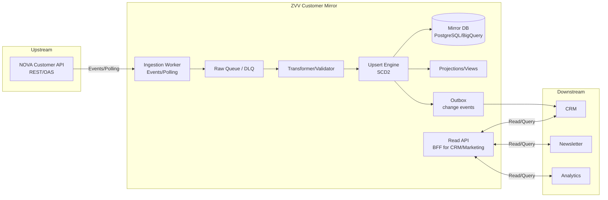
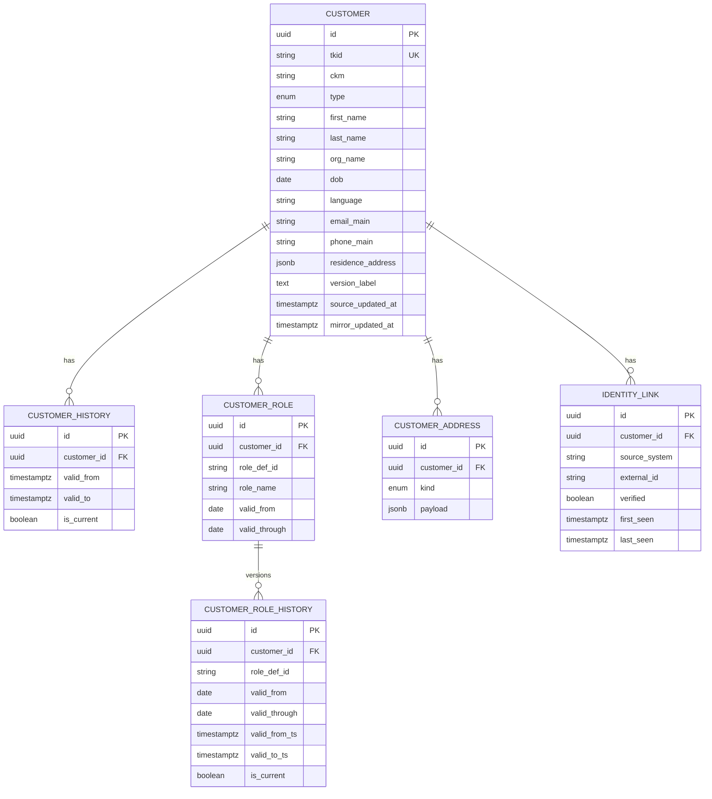
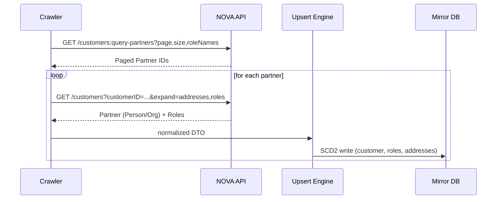
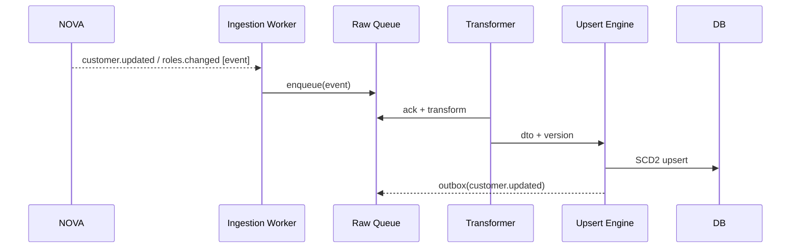
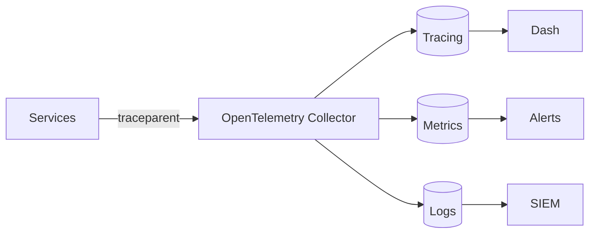
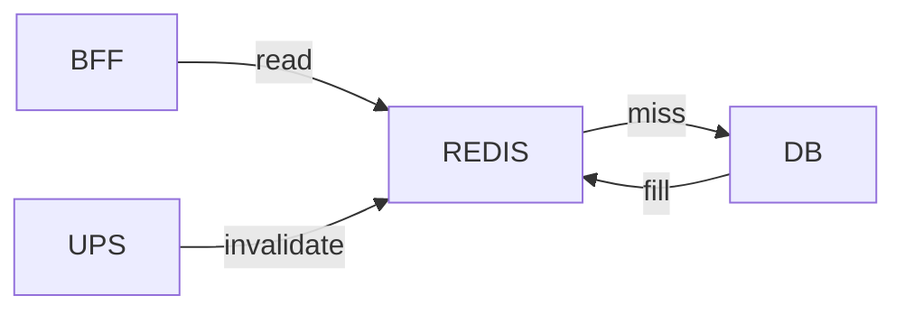

# ZVV Customer Mirror – Engineering Blueprint (NOVA Kunde)

> Status: Draft v0.9 • Owner: Marcel / ZVV • Letzte Aktualisierung: 2025‑08‑21 • Stil: Google Engineering Design Principles • REALITAETSFILTER: Annahmen sind mit [Ableitung] markiert, Unsicheres mit [Nicht verifiziert]

## 0. Executive Summary
Wir bauen einen **eigenen, stets aktuellen ZVV‑Kundenstamm** (Golden Record) ausserhalb von NOVA. Der Service spiegelt Kundendaten (Person/Organisation, Adressen, Rollen/Abos) aus NOVA, konsolidiert sie (SCD2 Historisierung) und exponiert **eine stabile interne API** fuer CRM, Newsletter, Analytics. Synchronisation erfolgt **eventgetrieben** (falls verfuegbar), sonst **inkrementell per Polling**. Auth via Zero‑Trust (mTLS + Token‑Exchange).

**Ziele**: Single Source of Truth, konsistente DTOs, niedrige Latenz fuer Reads, robuste Delta‑Syncs. **Nicht‑Ziele**: Ticketing‑Funktionen, Fachlogik zur Abo‑Verkaufskette.

---

## 1. Ziele, Nicht‑Ziele, Erfolgskriterien
**Ziele**
- Spiegel aller **ZVV‑relevanten Kunden** inkl. Rollen/Abos
- Nahezu Realtime‑Delta (< 60 s Events, < 5 min Polling)
- Kanonisches **CustomerDTO** + Projektionen fuer CRM/Marketing
- SCD2‑Historisierung und Auditierbarkeit

**Nicht‑Ziele**
- Keine Preis-/Produktlogik (NOVA bleibt Quelle)
- Kein direkter Public‑Edge‑Zugriff

**Erfolgskriterien (SLO/SLI)**
- p95 Read < 500 ms (Mirror)
- Sync‑Lag: Events < 60 s, Polling < 5 min
- Error‑Rate < 0.5 %; Verfuegbarkeit >= 99.9 %

---

## 2. Systemkontext (High‑Level)


[Hinweis] Events werden bevorzugt; falls nicht verfuegbar: Polling mit Zeitfenstern. [Ableitung]

---

## 3. Anforderungen & Annahmen
**Funktional**
- Identifikation „ZVV‑Kunde mit ZVV‑Abo“ via Rollen/Abos in NOVA
- Vollstaendiger Initial‑Backfill; danach Delta‑Sync
- Projektionen fuer CRM/Newsletter (z. B. Marketing‑View)

**Nichtfunktional**
- Tracing (`traceparent`), strukturierte Logs, Metriken
- Secrets in Vault/KMS, mTLS, Bearer (Token‑Exchange)

**Annahmen**
- [Nicht verifiziert] NOVA Customer‑Events verfuegbar (create/update/roles)
- [Nicht verifiziert] Rollen/Abo durch `roleDefinitionID`/Namen identifizierbar

---

## 4. Datenmodell (Kanonisch & DB)
### 4.1 Kanonisches DTO
```json
{
  "id": "<uuid>",
  "tkid": "<nova primaryCustomerID>",
  "ckm": "118-089-376-0",
  "type": "person|org",
  "name": {"first": "Max", "last": "Muster", "org": null},
  "dob": "1990-01-01",
  "language": "de",
  "emails": ["max@zvv.example"],
  "phones": ["+4144..."],
  "addresses": {"residence": {...}, "postal": [{...}]},
  "roles": [{"roleDefinitionID": "R-ZVV-ABO-XYZ", "validFrom": "2025-01-01", "validThrough": "2026-01-01"}],
  "version": "v12",
  "sourceUpdatedAt": "2025-08-21T07:00:00Z"
}
```

### 4.2 ER‑Modell (Mirror‑DB)


### 4.3 Rollen‑Mapping
Kurzstruktur `role_map(role_def_id → zvv_product_code, zvv_abotype, is_subscription_role)`.

---

## 5. Synchronisation
### 5.1 Initial‑Backfill (Batch)


### 5.2 Event‑Ingestion (Preferiert)


### 5.3 Fallback: Polling (Inkrementell)
```mermaid
flowchart LR
  P[Polling Scheduler] -->|every 1-5 min| QP[/query-partners since &lt;ts&gt;/]
  QP --> D[Diff Filter (by tkid, version, updated_at)] --> U[Upsert Engine] --> DB
  U --> C[Checkpoint last_success_ts]
```

### 5.4 Idempotenz & Reihenfolge
- Partitionierung nach `tkid` (Queue/Kafka) fuer Ordering
- Event‑Key: `{tkid}:{version}`; Duplikate wegfiltern
- Out‑of‑order: Version/TS vergleichen

---

## 6. Service‑Architektur (Detail)
```mermaid
graph LR
  subgraph Adapter
    NC[NOVA Client<br/>(mTLS, Tokens, Header)]
  end
  subgraph SyncLayer
    IWG[Ingestion Worker]
    TR[Transformer]
    UPS[Upsert Engine]
    OUTB[Outbox Processor]
  end
  subgraph Data
    DB[(Mirror DB)]
    REDIS[(Redis Cache)]
  end
  subgraph API
    BFF[Read API / BFF]
  end

  NC --> IWG
  IWG --> TR --> UPS --> DB
  UPS --> OUTB
  BFF --> REDIS
  BFF --> DB
```

**Schluesselentscheidungen**
- **CQS**: Writes ueber Ingestion‑Pfad; Reads ueber BFF/Views
- **Cache**: Read‑Through; TTL Stammdaten 15–60 min; Rollen 5–15 min
- **SCD2**: verlustfreie Historie

---

## 7. Schnittstellen (intern)
### 7.1 Read API
- `GET /customers/{id}?expand=addresses,roles`
- `GET /customers:search?name=...&email=...&role=zvv_product_code&page=...&size=...`
- `GET /customers/{id}/roles`
- `GET /customers:changed-since?ts=...` (Cursor)
- `GET /healthz`, `GET /readyz`

### 7.2 Webhooks / Events (Outbox)
- `customer.updated`, `customer.role.added`, `customer.role.removed`

### 7.3 Beispiel‑Antwort (Marketing‑View)
```json
{
  "id":"...","tkid":"...","name":"Max Muster",
  "segments":["abo_aktiv","renewal_30d"],
  "email":"max@example.com","language":"de",
  "abo": {"code":"ZVV-ABO-XYZ","validThrough":"2026-01-01"}
}
```

---

## 8. Auth, Header, Security
**Header**: `Authorization`, `traceparent`, `tracestate`, `Conversation-Id`, `Accept-Language`, `Organization`, `NOVA-Client`, `NOVA-Subject`, `Client-API-Version`, optional `Date-Shift`, `Time-Shift`.

**Security**: mTLS, Vault/KMS fuer Secrets, ABAC/RBAC intern, PII‑Scrubbing in Logs, DSG/DSGVO‑konform (Zweckbindung, Export/Loeschung orchestriert).

---

## 9. Resilienz & Policies
- Timeouts: connect 1.5 s, read 2.5–5 s
- Retries: max 3, exponential backoff + jitter (idempotent)
- Circuit Breaker: 50 % Failure‑Rate oder Slow‑Call > 2 s
- DLQ fuer unzustellbare Events, Re‑Drive Jobs

---

## 10. Observability

**KPIs**: Ingestion‑Lag, Events/min, p95 Read, Error‑Rate, Cache‑Hit‑Ratio, DLQ‑Depth.

---

## 11. Kapazitaet & Performance [Ableitung]
- Backfill Ziel: ~100k–1M Kunden, Paginierung 1k/Seite
- Polling: 1–5 min Intervalle; QPS an NOVA limitieren (Rate‑Limit budgetiert)
- Storage: SCD2 kann 3–5x Datenvolumen erzeugen

---

## 12. Teststrategie
- Contract‑Tests gegen NOVA (Schema, Status, Errors)
- E2E: Backfill, Delta, Idempotenz, Out‑of‑order
- Load: Suchspitzen, Cache‑Hit
- Chaos: 429/5xx, Token‑Ablauf, Netzwerkfehler
- Security: SAST/DAST, Secret‑Scanning, mTLS Checks

---

## 13. Risiken & Mitigation
- **Keine Events** → Polling + enges Fenster + Checkpointing
- **Uneindeutige Rollen/Abo** → `role_map` als Contract, QS‑Jobs
- **Rate‑Limits** → Backoff, Quota‑Manager, Caching
- **DQ‑Schwaechen** → Fuzzy nur minimal, Review‑Queue fuer Edge‑Faelle

---

## 14. Rolloutplan
1. Rollen‑IDs (ZVV‑Abos) von NOVA beschaffen [Nicht verifiziert]
2. DB‑Schema & Upsert‑Engine (SCD2) implementieren
3. Initial‑Crawler + Checkpointing
4. Read‑API + Projektionen fuer CRM/MKT
5. Event‑Listener oder Poller aktivieren
6. Pilot‑Backfill, Abnahme, dann Vollabzug
7. Cutover CRM/Newsletter auf Mirror, NOVA‑Direktzugriff beenden

---

## 15. Appendix
### 15.1 Upsert‑Pseudocode (idempotent)
```pseudo
onChange(dto):
  begin tx
    existing = loadByTKID(dto.tkid)
    if hasFieldChanges(existing, dto):
      closeCurrentHistory(existing)
      applySCD2(existing, dto)
      writeCurrent(existing)
    upsertRoles(dto.roles)
    upsertAddresses(dto.addresses)
    writeChangeLog(dto.key, dto.version)
  commit
```

### 15.2 Caching‑Strategie


### 15.3 Security‑Header Cheatsheet
- Authorization: Bearer <token>
- traceparent / tracestate
- Conversation-Id
- Accept-Language
- Organization / NOVA-Client / NOVA-Subject
- Client-API-Version
- Date-Shift / Time-Shift (DEV/QA)

---

> Offene Punkte zum Abschluss: Event‑Verfuegbarkeit (Customer‑Scope), exakte roleDefinitionIDs fuer ZVV‑Abos, Rate‑Limits je Endpoint/Client. [Nicht verifiziert]

